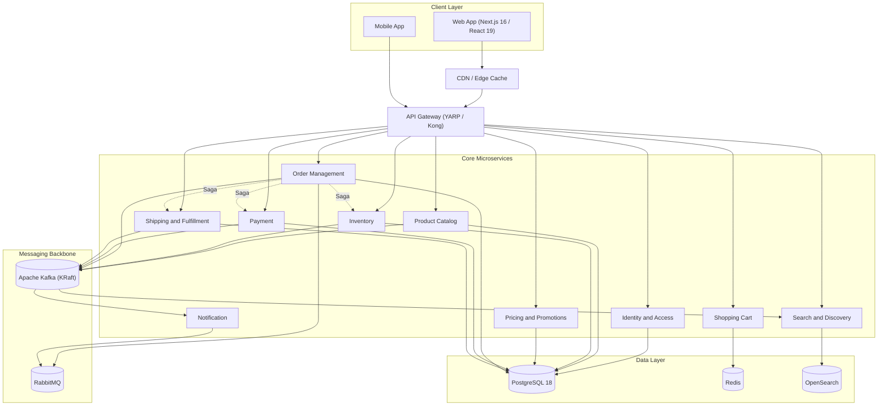

# E-Commerce Platform — Software Design & Architecture Requirements

**Version:** 2.0 (Modernized)
**Supersedes:** v1.0
**Last updated:** July 2026

## Purpose

This document defines the target-state architecture for a cloud-native, event-driven e-commerce platform. It updates the original design to current (mid-2026) technology baselines, extends the service catalog to match what a production e-commerce platform actually needs, and makes the messaging/eventing layer a first-class part of the architecture rather than a single service's implementation detail.

## What Changed from v1.0

| Area | v1.0 | v2.0 |
|---|---|---|
| Frontend | React + Next.js + TypeScript (no versions pinned) | React 19.2, Next.js 16.2, TypeScript 7.0 (Go-based compiler) |
| Database | PostgreSQL (version unspecified) | PostgreSQL 18, with a defined upgrade path to PostgreSQL 19 |
| Backend runtime | ASP.NET Core (version unspecified) | ASP.NET Core 10 / .NET 10 (LTS) |
| Messaging | RabbitMQ, scoped to the Cart service only | Apache Kafka (event backbone) + RabbitMQ (task queues), used platform-wide, with outbox/Saga patterns |
| Services | 5 services | 10 core services + 3 roadmap services |
| CI/CD | GitHub Actions + Jenkins | GitHub Actions (CI) + ArgoCD/GitOps (CD) |
| Logging | ELK Stack | OpenTelemetry + Grafana (Loki/Tempo/Prometheus); ELK listed as an alternative |
| Security | JWT, RBAC, HTTPS, OAuth 2.0 | + OIDC, passkeys/WebAuthn, mTLS via service mesh, secrets management, PCI scope isolation |
| Diagram | Text description, external tool required | Mermaid diagram embedded in this document |
| New | — | Service mesh, schema registry, Saga/outbox patterns, agentic-commerce readiness |

---

## 1. Architecture Overview

- **Microservices architecture**: each service owns its data, is independently deployable/scalable, and communicates via well-defined synchronous (REST) and asynchronous (event) contracts.
- **API Gateway**: single entry point for client traffic; handles auth, routing, rate limiting, and request logging (see §7).
- **Service Discovery**: Kubernetes-native DNS/service discovery for in-cluster routing.
- **Service Mesh** *(new)*: Istio or Linkerd sidecars for mTLS between services, traffic shaping, and canary/blue-green rollouts — without adding this logic to application code.
- **Event-driven backbone** *(new)*: Apache Kafka for domain events and Search/Analytics sync; RabbitMQ for task queues (see §4).
- **Database-per-service**: PostgreSQL 18, one logical database (or schema, depending on isolation needs) per service — no cross-service joins or shared tables.
- **Polyglot persistence**: Redis for cache/session/cart state; OpenSearch for the Search & Discovery index. Postgres remains the system of record everywhere else.

## 2. Core Services (Phase 1 / Launch)

Each service is described with four attributes: what it does, what it's built on, its primary endpoints, and the events it publishes/consumes — the last of these makes the event-driven architecture concrete rather than diagram-only.

### 2.1 Identity & Access Management Service
*(formerly "User Management Service")*
- **Features**: registration, login, MFA, social/SSO login, passwordless login via passkeys (WebAuthn), profile management, role assignment (RBAC)
- **Tech stack**: ASP.NET Core 10, ASP.NET Core Identity, PostgreSQL 18, JWT + OAuth 2.1/OIDC
- **Key endpoints**: `POST /api/identity/register`, `POST /api/identity/login`, `POST /api/identity/refresh-token`, `GET/PUT /api/identity/profile`
- **Publishes**: `UserRegistered`, `UserProfileUpdated`
- **Consumes**: —

### 2.2 Product Catalog Service
- **Features**: CRUD for products, categories/taxonomy, variants, rich media, structured product data (schema.org/JSON-LD) for SEO and AI-agent discoverability
- **Tech stack**: ASP.NET Core 10, EF Core, PostgreSQL 18, Redis (read-through cache)
- **Key endpoints**: `GET /api/catalog/products`, `GET /api/catalog/products/{id}`, `POST/PUT/DELETE /api/catalog/products/{id}`, `GET /api/catalog/categories`
- **Publishes**: `ProductCreated`, `ProductUpdated`, `ProductDeleted`, `ProductPriceChanged`
- **Consumes**: `InventoryLevelChanged` (to surface stock badges)

### 2.3 Inventory Service *(new)*
- **Features**: real-time per-SKU/per-warehouse stock, reservation holds during checkout, oversell prevention, low-stock alerts
- **Tech stack**: ASP.NET Core 10, PostgreSQL 18 (strong consistency), Redis (short-lived reservation locks)
- **Key endpoints**: `GET /api/inventory/{sku}`, `POST /api/inventory/reserve`, `POST /api/inventory/release`
- **Publishes**: `InventoryLevelChanged`, `StockReserved`, `StockReleased`, `LowStockAlert`
- **Consumes**: `OrderPlaced`, `OrderCancelled`

### 2.4 Search & Discovery Service *(new)*
- **Features**: full-text and faceted search, autocomplete, filters, synonym handling, ranking
- **Tech stack**: ASP.NET Core 10 (thin API), OpenSearch (index), Kafka consumer to keep the index in sync
- **Key endpoints**: `GET /api/search`, `GET /api/search/autocomplete`, `GET /api/search/facets`
- **Publishes**: —
- **Consumes**: `ProductCreated`, `ProductUpdated`, `ProductDeleted`, `ProductPriceChanged`, `InventoryLevelChanged`

### 2.5 Shopping Cart Service
- **Features**: add/remove/update line items, guest and authenticated carts, cart merge on login, saved-for-later, abandonment triggers
- **Tech stack**: ASP.NET Core 10, Redis (primary store — carts are ephemeral and latency-sensitive)
- **Key endpoints**: `GET /api/cart`, `POST /api/cart/items`, `DELETE /api/cart/items/{productId}`, `POST /api/cart/merge`
- **Publishes**: `CartAbandoned`
- **Consumes**: `ProductPriceChanged`, `InventoryLevelChanged`

### 2.6 Pricing & Promotions Service *(new)*
- **Features**: coupon/discount codes, tiered and bulk pricing, flash sales, cart- and item-level promotion rules
- **Tech stack**: ASP.NET Core 10, PostgreSQL 18, Redis (rule evaluation cache)
- **Key endpoints**: `POST /api/pricing/evaluate`, `GET /api/promotions/active`, `POST /api/promotions/validate-code`
- **Publishes**: `PromotionApplied`
- **Consumes**: `OrderPlaced` (usage-count tracking)

### 2.7 Order Management Service
- **Features**: order creation, status tracking, history, cancellations/returns, and **Saga orchestration** across payment, inventory, and shipping
- **Tech stack**: ASP.NET Core 10, EF Core, PostgreSQL 18, Kafka (orchestration + transactional outbox)
- **Key endpoints**: `POST /api/orders`, `GET /api/orders/{id}`, `GET /api/orders`, `POST /api/orders/{id}/cancel`
- **Publishes**: `OrderPlaced`, `OrderConfirmed`, `OrderCancelled`, `OrderCompleted`
- **Consumes**: `PaymentAuthorized`, `PaymentFailed`, `StockReserved`, `ShipmentDispatched`

### 2.8 Payment Service *(new — split out of Order Management for PCI scope isolation)*
- **Features**: authorization/capture, refunds, multiple payment methods (card, wallet, BNPL), tokenized storage via processor (no raw card data at rest)
- **Tech stack**: ASP.NET Core 10, PostgreSQL 18 (metadata only), PCI-compliant processor integration (e.g., Stripe/Adyen/Braintree)
- **Key endpoints**: `POST /api/payments/authorize`, `POST /api/payments/capture`, `POST /api/payments/refund`
- **Publishes**: `PaymentAuthorized`, `PaymentCaptured`, `PaymentFailed`, `RefundIssued`
- **Consumes**: `OrderPlaced`

### 2.9 Shipping & Fulfillment Service *(new)*
- **Features**: multi-carrier rate shopping, label generation, tracking, delivery estimates, returns/RMA
- **Tech stack**: ASP.NET Core 10, PostgreSQL 18, carrier API integrations (e.g., EasyPost/Shippo or direct carrier APIs)
- **Key endpoints**: `POST /api/shipping/rates`, `POST /api/shipping/label`, `GET /api/shipping/track/{id}`
- **Publishes**: `ShipmentCreated`, `ShipmentDispatched`, `ShipmentDelivered`
- **Consumes**: `OrderConfirmed`

### 2.10 Notification Service
- **Features**: multi-channel delivery (email, SMS, push, in-app), templated messages, user notification preferences
- **Tech stack**: ASP.NET Core 10, RabbitMQ (task queue), SendGrid/Twilio/FCM/APNs
- **Key endpoints**: `GET/PUT /api/notifications/preferences`
- **Publishes**: —
- **Consumes**: `OrderPlaced`, `OrderConfirmed`, `ShipmentDispatched`, `PaymentFailed`, `LowStockAlert`

## 3. Phase 2 / Roadmap Services

Not required for launch, but the event backbone in §4 is designed so these can be added later without touching existing services:

- **Reviews & Ratings Service** — product reviews, star ratings, moderation queue, verified-purchase badges
- **Recommendation & Personalization Service** — "you may also like," recently viewed, personalized homepage (consumes clickstream + order history from Kafka)
- **Analytics & Reporting Service** — clickstream ingestion, business dashboards, cohort analysis (Kafka consumer, no impact on transactional services)

---

## 4. Messaging & Event-Driven Architecture *(new)*

This is the biggest structural change from v1.0, where RabbitMQ was scoped to a single service. In v2.0, eventing is the primary way services stay in sync without tight coupling.

### Apache Kafka 4.2 (KRaft mode) — the event backbone
- Kafka 4.0 removed ZooKeeper entirely; the metadata quorum now runs natively via KRaft, so there's one fewer distributed system to operate.
- Used for domain events: order lifecycle, inventory changes, catalog changes, and the clickstream feeding Search, Analytics, and Recommendations.
- Because Kafka retains the event log, Search, Analytics, and Recommendation services can rebuild their state by replaying a topic instead of every service needing a direct API integration with every producer.
- A schema registry (Avro or Protobuf) versions event contracts, so producers and consumers don't drift apart silently.

### RabbitMQ 4.3 — task and command queues
- Used for point-to-point async jobs: sending a specific email, generating an invoice PDF, retrying a flaky third-party call.
- RabbitMQ 4.3 moved to Khepri as its metadata store (replacing the legacy Mnesia-based store) and added delayed retries and consumer timeouts — both useful for notification/retry workflows.
- Native DLQ and per-message TTL/retry handling are more mature here than in Kafka for this style of workload.
- Worth watching: Kafka's own "Queues for Kafka" (KIP-932 share groups) adds native queue-like consumption to Kafka. It's not yet a reason to drop RabbitMQ, but re-evaluate as it matures past early access.

### Reliability patterns (apply platform-wide)
- **Transactional outbox**: any service that writes to Postgres and publishes an event does both in one local transaction, avoiding the dual-write problem.
- **Saga pattern**: the Order → Payment → Inventory → Shipping flow is orchestrated (Order Management Service is the coordinator), so compensation/rollback logic lives in one place instead of being scattered across services.
- **Idempotent consumers**: both brokers are at-least-once delivery, so consumers dedupe on event ID.
- **Dead-letter queues** with exponential backoff on every consumer.

---

## 5. Frontend Application

| Layer | Technology |
|---|---|
| UI library | React 19.2 (React Compiler, Server Components) |
| Framework | Next.js 16.2, App Router, Turbopack (default bundler) |
| Language | TypeScript 7.0 (Go-based compiler), strict mode |
| Styling | Tailwind CSS |
| Components | shadcn/ui / Radix primitives |
| Server state | TanStack Query |
| Client state | Zustand |
| Testing | Vitest (unit), Playwright (e2e) |
| Runtime | Node.js 24 (LTS) |

- **Performance**: Core Web Vitals budgets enforced in CI, `next/image` for image optimization, streaming SSR.
- **PWA**: installable, offline cart persistence.
- **Accessibility**: WCAG 2.2 AA as the baseline.
- **AI/agent discoverability** *(new)*: structured product data (schema.org `Product`, JSON-LD) so both search engines and AI shopping agents can read catalog data reliably — see §13.
- **Note**: pin to a patched React 19.2.x release — early 19.x releases with Server Components had a disclosed vulnerability that's fixed in current patches.

**Pages**: Home, Product Listing / Search Results, Product Detail, Cart, Checkout, Order History, Order Tracking, Wishlist, User Profile *(a Reviews page ships when the Reviews service does — see §3)*.

---

## 6. Database & Data Management

- **PostgreSQL 18** (latest stable major) as the system of record for every service except Cart (Redis) and Search (OpenSearch). PostgreSQL 19 is in beta as of mid-2026, expected to reach GA in Q3/Q4 2026 — worth planning an upgrade path for, not an immediate requirement.
- **Database-per-service**, with logical replication for read replicas on read-heavy services (Catalog, Order history).
- **Connection pooling**: PgBouncer, or Npgsql's built-in pooling from the .NET side.
- **Redis** (latest stable): cart storage, caching, distributed locks (inventory reservations), rate-limit counters.
- **OpenSearch**: dedicated index for Search & Discovery — not a system of record, always rebuildable from Kafka.
- **Migrations**: EF Core Migrations, applied through the CI/CD pipeline rather than manually.
- **Backup/DR**: automated backups, point-in-time recovery, multi-AZ for production.

---

## 7. API Design & Gateway

- **API Gateway**: YARP (.NET-native reverse proxy) or Kong — either fits the ASP.NET Core stack; standardize on one rather than mixing.
- **REST** as the primary service-to-service and client-facing protocol. An optional **GraphQL BFF** (Backend-for-Frontend) layer can aggregate Catalog + Pricing + Inventory for the frontend in one round trip if over-fetching becomes a measured problem — don't add it speculatively.
- **Versioning**: URL-based (`/api/v1/...`) for external-facing endpoints.
- **Rate limiting/throttling** at the gateway, per client and per endpoint class (checkout and login get stricter limits than catalog browsing).
- **OpenAPI/Swagger** generated directly from ASP.NET Core Minimal APIs.

---

## 8. Deployment & Infrastructure

- **Containerization**: Docker.
- **Orchestration**: Kubernetes.
- **Package management**: Helm.
- **CI**: GitHub Actions — build, test, scan.
- **CD**: ArgoCD (GitOps) — **replaces Jenkins from v1.0**. Deployment state lives declaratively in Git, is auditable, and removes a second CI/CD system to maintain. If the team has deep existing Jenkins pipelines, phase this in rather than a hard cutover.
- **IaC**: Terraform for underlying cloud infrastructure (cloud-agnostic, matches the K8s/Docker/Helm stack).
- **Service mesh**: Istio or Linkerd — mTLS, traffic shaping, canary/blue-green rollouts.
- **Autoscaling**: HPA for CPU/memory-based scaling; KEDA for event-driven scaling (e.g., scale Order/Notification consumers on Kafka/RabbitMQ queue depth, not just CPU).

---

## 9. Security

- **AuthN/AuthZ**: OAuth 2.1 / OpenID Connect.
- **Passwordless**: WebAuthn/passkeys offered alongside traditional login *(new)*.
- **Tokens**: short-lived JWT access tokens (~15 min) with rotating refresh tokens.
- **Authorization**: RBAC, with resource-level (ABAC-style) checks where role-only isn't granular enough.
- **Service-to-service**: mTLS via the service mesh — no plaintext internal traffic.
- **Secrets management**: HashiCorp Vault or a cloud-native KMS — never in config files or environment variables checked into Git.
- **WAF** at the gateway/CDN edge.
- **PCI DSS scope isolation**: the Payment Service is the only service that talks to the payment processor; raw card data never touches application databases.
- **Privacy**: GDPR/CCPA data subject access and erasure endpoints, consent management, AES-256 at rest, TLS 1.3 in transit.
- **Supply chain**: dependency and container image scanning in CI (Trivy/Snyk), SBOM generation.
- **Abuse protection**: rate limiting and bot/credential-stuffing protection specifically on login and checkout endpoints.

---

## 10. Observability & Monitoring

- **OpenTelemetry** for unified, vendor-neutral instrumentation (traces, metrics, logs) across every service — instrument once, route anywhere.
- **Metrics**: Prometheus + Grafana.
- **Logs**: Grafana Loki (lighter-weight and cheaper to run than the ELK Stack at this scale). ELK remains a reasonable alternative if the team already has that operational expertise.
- **Tracing**: Grafana Tempo (or Jaeger), with trace context propagated through Kafka/RabbitMQ message headers so a checkout flow is traceable end-to-end, not just within a single request.
- **Alerting**: Alertmanager → PagerDuty/Opsgenie.
- **SLOs/SLIs**: defined per core service, starting with Checkout, Search, and Catalog — see §12.

---

## 11. Scalability, Performance & Reliability

- **Autoscaling**: HPA + KEDA (see §8).
- **CDN**: static assets and product images served from a CDN edge (e.g., CloudFront/Cloudflare), with an image optimization pipeline.
- **Caching**: layered — CDN edge → Redis → database read replica — so the database is the last resort, not the first hit.
- **Load testing**: k6 as part of the release pipeline for the checkout and search paths specifically.
- **Resilience testing**: chaos engineering practices (e.g., killing a pod, injecting broker latency) run against staging before every major release.
- **Multi-AZ / multi-region**: prioritize the checkout and payment path first, since that's the revenue-critical path — broader multi-region can follow.

---

## 12. Non-Functional Requirements — Suggested Starting Targets

These are starting points to refine with actual stakeholders/SLAs, not fixed commitments:

| Metric | Suggested target |
|---|---|
| Page load (LCP) | < 2.5s on 4G |
| API p95 latency (read) | < 200ms |
| API p95 latency (checkout write) | < 500ms |
| Search query latency | < 150ms |
| Platform uptime | 99.9% (99.95% for checkout/payment path) |
| Checkout error rate | < 0.1% |
| Event processing lag (Kafka consumer) | < 5s under normal load |

---

## 13. Agentic Commerce Readiness *(new, forward-looking)*

By mid-2026, AI shopping agents are a real and growing checkout channel — OpenAI/Stripe's Agentic Commerce Protocol (ACP), Google's Universal Commerce Protocol (UCP), and Anthropic's Model Context Protocol (MCP) for structured data access are the leading standards, alongside agent-to-agent delegation (A2A) and tokenized agent payments. This space is still standardizing, so treat it as **evaluate-and-prepare**, not a hard v2.0 requirement:

- Keep product data structured and machine-readable (schema.org/JSON-LD — already required in §5/§2.2) so agents can read the catalog without scraping rendered pages.
- Design the Payment Service (§2.8) around tokenized, processor-scoped credentials — the same shape agent-payment tokens use — so adding an agent checkout path later doesn't require re-architecting payments.
- Revisit protocol support (ACP/UCP) once one of them shows clearer market consolidation; integrating too early against a standard that's still moving is wasted engineering effort.

---

## 14. Architecture Diagram

*Renders natively on GitHub, GitLab, and most modern Markdown viewers — no external diagramming tool required, unlike the v1.0 textual description.*

---

## 15. Technology Stack Summary

| Layer | Technology | Notes |
|---|---|---|
| Frontend | React 19.2, Next.js 16.2, TypeScript 7.0 | Run latest patch releases |
| Backend runtime | ASP.NET Core 10 / .NET 10 (LTS) | Supported through Nov 2028 |
| Database | PostgreSQL 18 | v19 in beta, GA expected Q3/Q4 2026 |
| Cache / session | Redis (latest stable) | |
| Search index | OpenSearch | |
| Event streaming | Apache Kafka 4.2 (KRaft) | No ZooKeeper |
| Task queues | RabbitMQ 4.3 | Khepri metadata store |
| Containerization | Docker | |
| Orchestration | Kubernetes + Helm | |
| GitOps / CD | ArgoCD | |
| CI | GitHub Actions | |
| IaC | Terraform | |
| Service mesh | Istio or Linkerd | |
| Metrics | Prometheus + Grafana | |
| Logs | Grafana Loki (or ELK) | |
| Tracing | Grafana Tempo (or Jaeger) | |
| Instrumentation | OpenTelemetry | |

---

*This document is a living artifact — revisit pinned version numbers before each major planning cycle, since the frontend and messaging ecosystems move quickly.*
